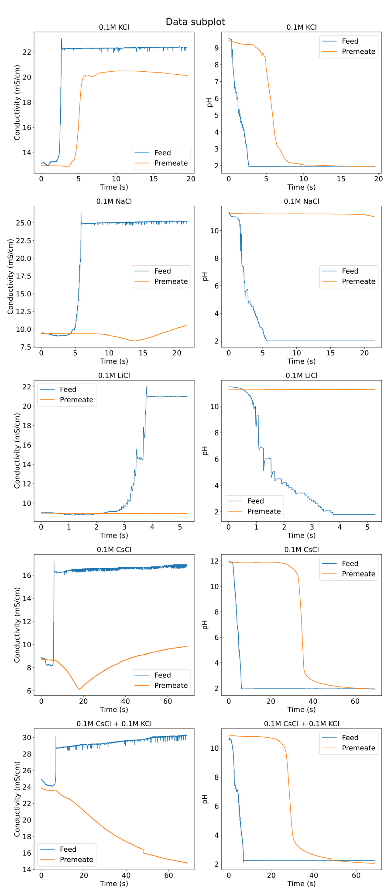

# Membrane pH Prediction

This repository contains the code and data for a data science project that aims to predict the pH of a membrane using an RNN model based on PyTorch Lightning. The predicted pH values are used by a collaborative robot to calibrate solutions and continue its membrane synthesis process.

## Installation

To install the dependencies, you can use either pip or conda. Here are the installation steps:

1. Clone this repository:

   ```shell
   git clone https://github.com/ShockOfWave/membrane_robot_project.git

2. Navigate to the project directory:

   ```shell
   cd your-project

3. Install the dependencies using pip:

   ```shell
   pip install -r requirements.txt
   ```

   or using conda:

   ```shell
   conda env create -f environment.yml
   conda activate membrane_robot
   ```
## Notebooks

The `notebook` folder contains Jupyter notebooks for training and evaluation the RNN model.

## Data

The raw data used in this project is presented in the following figure:



## Model Evaluation

The evaluation results of the RNN model are presented in `report` folder

## Collaborative Robot Code
The repository also includes code for the collaborative robot, which utilizes the predicted pH values to calibrate solutions during the membrane synthesis process.

## Acknowledgements

We would like to acknowledge the following colleagues for their contributions to this project

## License

This project is licensed under the MIT License - see the [LICENSE](LICENSE) file for details.